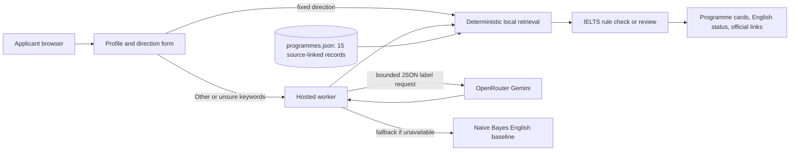

# DS Compass product documentation

## Persona and user problem

**Primary persona:** an international graduate exploring selected taught master's programmes in Singapore and the United Kingdom. They may understand their intended field but not the local programme names, prerequisites or English-language evidence rules.

**Job to be done:** turn one primary study direction into a small set of official-source programme pages to investigate further.

**Product boundary:** DS Compass supports research. It does not rank universities, predict admission, decide academic eligibility, convert GPA, submit applications, or give visa advice.

## Inputs and outputs

| Input | Use | Not used for |
| --- | --- | --- |
| Destination and study direction | Select same-region, same-domain records | University ranking or admission likelihood |
| Short keywords for Other or unsure | Classify into a fixed direction or abstain | Programme-fact generation |
| School, optional background, degree and GPA | Displayed as user context | Scoring or ordering a programme |
| IELTS overall and components | Compare only to encoded IELTS rules | Full eligibility decision |
| TOEFL iBT total | Record for the user | Conversion to an unsupported IELTS equivalent |

Each output card gives a programme title, university, region, concise author paraphrase, English-evidence status and official source link. The status is **supported**, **gap**, or **review**. It is not an admission result.

## Product architecture

The browser never receives the OpenRouter key. `worker.mjs` validates requests, limits input size, constrains model output to fixed labels and serves the resulting response. The model does not receive the programme catalogue or applicant history.

## Metrics targeted and reached

| Metric | Target | Reached | Interpretation |
| --- | --- | --- | --- |
| Interest-label accuracy | Demonstrate improvement over a trivial majority baseline | 86.5% exact label vs 18.9% majority baseline | 37 frozen synthetic cases only |
| Safe handling of unsuitable requests | Do not force an unsupported programme match | Abstention rate 8.1%; marine-biology example abstains | Not a measurement of all real user requests |
| Evidence traceability | Every displayed programme has a direct official link | 15/15 catalogue records | Source freshness still requires rechecking |
| English-rule communication | No automatic full-eligibility claim | supported, gap or review status on each result | Some cards deliberately remain review-only |

## Known limitations and next steps

The catalogue is small; requirements may change; synthetic metrics may be optimistic; and the English fallback is not equally capable for Chinese. The next version needs a consented, human-labelled query set, a separate development set for tuning, a second reviewer for source encoding, and a scheduled data refresh process.
