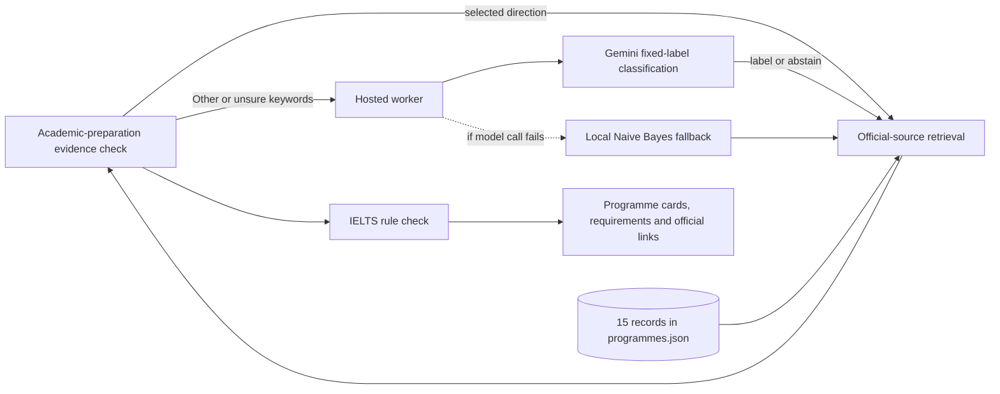

# Product notes

## Who the app is for

I designed DS Compass for an international applicant who has picked a broad subject area but is unsure which programme pages to compare. The first version focused on Singapore. The final prototype also includes the United Kingdom, following the project scope discussed in the proposal.

The user's task is modest: choose a country and a study direction, then use a small shortlist to continue their own research. The app does not claim to choose a university for them.

## What goes in and what comes out

| Input | What the app does with it |
| --- | --- |
| Country and selected direction | Retrieves programme records by region and domain |
| Short keywords under Other or unsure | Sends them to the hosted classifier, which returns a fixed label or abstains |
| School, optional background category, major and GPA | Keeps them in the submitted profile; they do not affect retrieval |
| IELTS overall and four component scores | Compares them with the encoded IELTS fields when those fields exist |
| TOEFL iBT total | Records the score; no IELTS conversion is attempted |

Each result card shows a programme name, university, country, short description, English-evidence message and an official page link. `supported` means the recorded IELTS threshold is met. `gap` means a recorded score is below a threshold. `review` means the catalogue cannot make that comparison. None of these labels decides academic eligibility.

Each card also exposes the recorded academic requirement and an academic-preparation evidence label. It uses the selected degree only to show whether the degree is broadly related to the recorded requirement or needs manual checking. It does not use school name, 985/211 category or GPA to calculate an offer likelihood. The original proposal mentioned historical admission cases and Reach/Match/Safer labels; those require verified, country-specific outcome data, which this prototype does not hold.

## Request path

The worker is the only part that holds the model key. It validates the profile, caps the request body, limits model calls and checks that the classifier returned an allowed label. The model does not receive the programme catalogue or application histories. The final cards are looked up from local JSON data.

## Measures and current results

I had not set a minimum accuracy target before running the model, so 86.5% is a result to interpret, not a pass against a pre-registered threshold. For context, always choosing the majority label (`abstain`) would match 7 of 37 cases (18.9%); Gemini matched 32 of 37 (86.5%).

The main boundary measure was the share of out-of-scope examples withheld. There was no pre-set numeric target for this either. The model abstained on three of seven; it gave an in-scope label to the other four. The fixed examples and outputs are in `evals/`.

The catalogue has a different check: all 15 rows have a source URL, but that does not mean the catalogue covers the market or that the source is still current. English rules also remain incomplete for some programmes; those cards return `review`.

The academic-preparation rule passes all eight hand-specified cases in `evals/profile_evidence_cases.json`. That is a regression check for the rule, not a measure of admission accuracy.

## Work left

The useful next evaluation would be a small set of consented applicant queries labelled by people, split before any threshold adjustment. The programme data also needs a second reviewer. Neither step was completed for this prototype.
